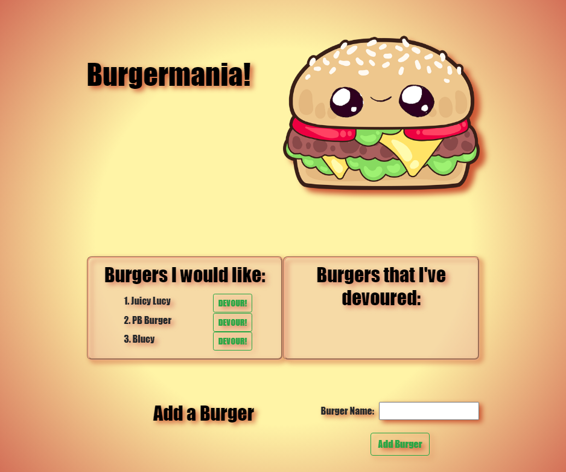

# Burgermania!
  
  

  ## Table of Contents
  * [**Description**](#description)
  * [**Installation**](#installation)
  * [**Usage**](#usage)
  * [**Contributing**](#contributing)
  * [**Tests**](#tests)
  * [**Support Team**](#support-team)
  * [**License**](#license)
  * [**Questions**](#questions)

  ## Description
  A burger logging webpage with MySQL, Node, Express, Handlebars, and ORM. Deployed with Heroku, this project follows the MVC design pattern. The user can submit burgers, which will be saved in the database and can be updated (devoured)!

  Deployed at: https://peaceful-peak-71723.herokuapp.com/

  Repository: https://github.com/LindseyM20/burgermania

  ## Installation
  Commands to run to install dependencies: npm install

  ## Usage
  Use this app to keep track of your burger bucket list and remember your favorite devoured burgers!

  

  ## Contributing
  [Contributor Covenant Code of Conduct](https://www.contributor-covenant.org/version/2/0/code_of_conduct/code_of_conduct.md)

  ## Tests
  Command to run tests: N/A
  
  ## Support Team
  Special thanks to: 

  [Amanda Anderson](https://github.com/aanderson120)

  [Brooklynne Audette](https://github.com/B-Audette)

  [Dorotea Flores-Kestner](https://github.com/dfkestner)
  

  ## License
  The contents of this repository are protected under the Unlicense license

  ## Questions
  Follow me on GitHub at https://github.com/LindseyM20

  Please contact me with any questions or feedback at lindsey.bordner@gmail.com 
